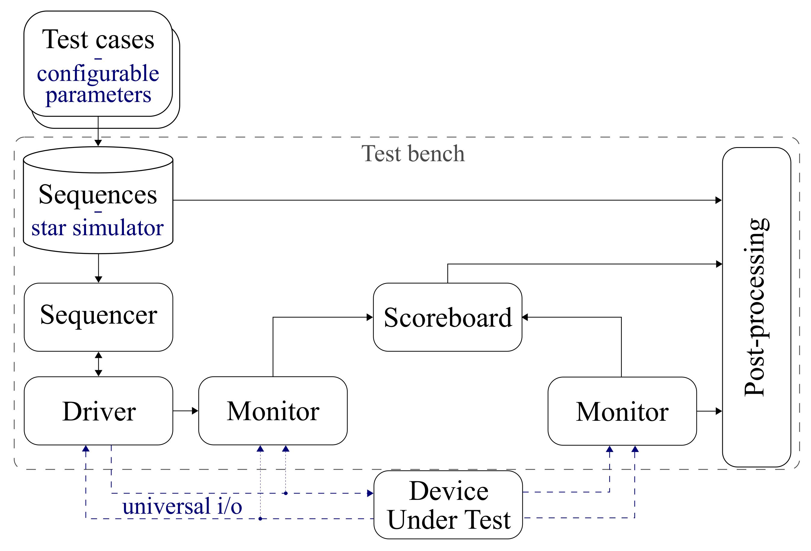

# Simplified Verification Platform for Star Trackers

A streamlined verification platform for testing star tracker algorithms with reduced dependencies and complexity. This platform enables testing and validation of star tracker designs through simulation and automated verification processes, while maintaining the structural principles of the Universal Verification Methodology (UVM).


*Figure: Structure of the verification platform following UVM nomenclature, with specialized blocks for star tracker verification.*

## About This Project

This is a simplified version of the comprehensive verification platform described in the research paper:

> Schulz, V. H., Marcelino, G. M., Seman, L. O., Santos Barros, J., Kim, S., Cho, M., Villarrubia González, G., Leithardt, V. R. Q., & Bezerra, E. A. (2021). Universal Verification Platform and Star Simulator for Fast Star Tracker Design. *Sensors*, 21(3), 907. https://doi.org/10.3390/s21030907

**📚 Please cite this paper if this verification platform is useful for your research.**

### Key Simplifications

This simplified version maintains the core functionality while reducing complexity:

- **Reduced Dependencies**: Eliminated SystemC, UVM-SystemC, Atlas/BLAS, and GHDL dependencies
- **Streamlined Architecture**: Structurally resembles UVM-SystemC principles without requiring the actual framework
- **Focused Testing**: Concentrates on software-based star tracker algorithms
- **Easier Setup**: Simplified installation and configuration process

### Original Repository

The full-featured original version is available at:
**[Verification Platform for Star Trackers](https://github.com/schulz89/Verification-Platform-for-Star-Trackers)** (archived)

## Features

- **Star Simulator**: Generates realistic star field images for testing
- **Comprehensive Testing**: Covers centroiding, star identification, and attitude determination
- **Software DUT Support**: Focuses on software implementation verification
- **Automated Verification**: Includes test sequences and scoreboards for automated validation
- **Minimal Dependencies**: Streamlined dependency list for easier setup

## Getting Started

### Prerequisites

Ensure you have the required dependencies installed (see [Dependencies](#dependencies) section below).

### Quick Start

1. **Clone the repository**:
   ```bash
   git clone https://github.com/schulz89/Simplified-Verification-Platform-for-Star-Trackers.git
   cd Simplified-Verification-Platform-for-Star-Trackers
   ```

2. **Build the platform**:
   ```bash
   make
   ```

3. **Download star catalog**:
   ```bash
   ./download_hipparcos
   ```

4. **Run tests**:
   ```bash
   ./run_tests
   ```

## Project Structure

- `src/verification_platform/` - Main verification platform implementation
- `src/grid_database/` - Star catalog database management  
- `src/data_processing/` - Data processing utilities and configurations
- Tests are organized by functionality in `src/verification_platform/test/`

## Dependencies

This simplified platform was tested on **Fedora 41** with significantly reduced dependencies:

| Component                 | Purpose                              |
| ------------------------- | ------------------------------------ |
| OpenCV (including Python) | Image processing and computer vision |
| OpenBLAS                  | Basic Linear Algebra Subprograms     |
| Boost                     | C++ libraries                        |
| Python                    | Scripting and data processing        |
| NumPy                     | Numerical computing for Python       |
| Matplotlib                | Plotting library for Python          |

### Installation

Example installation command for Fedora Linux:

```bash
sudo dnf install opencv-devel python3-opencv openblas-devel boost-devel python3-numpy python3-matplotlib
```

## Removed Features (vs. Original)

The following features from the original platform are not included in this simplified version:

- **VHDL Simulation**: GHDL integration removed (may be added in future versions)
- **SystemC Framework**: No longer depends on SystemC/UVM-SystemC
- **TCP DUT Client**: Hardware-in-the-loop testing capability removed (may be added in future versions)
- **Atlas Library**: Replaced with OpenBLAS for simpler setup

## Contributing

This is an active development project. Contributions are welcome! Please feel free to submit issues and pull requests.

## License

This software is licensed under **Apache License, Version 2.0**

## Support

For questions or support, please open an issue in this repository's issue tracker.
